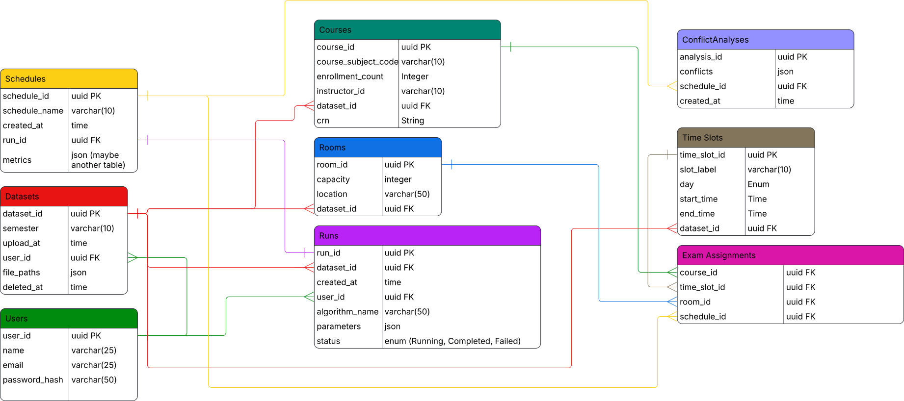

# Data Guide

CSV file formats, database management, and data operations for ExamEngine.

## CSV File Formats

ExamEngine requires three CSV files to generate exam schedules. The system auto-detects column names from multiple aliases.

### courses.csv

Contains course/section information.

| Column           | Required | Accepted Names                                                | Description                   |
| ---------------- | -------- | ------------------------------------------------------------- | ----------------------------- |
| crn              | ✅       | `CRN`, `Course Registration Number`, `crn`                    | Unique course identifier      |
| course_code      | ✅       | `CourseID`, `Course ID`, `Course Code`, `course_subject_code` | e.g., "CS 4535"               |
| enrollment_count | ✅       | `num_students`, `Enrollment`, `Student Count`, `Size`         | Number of students            |
| instructor_name  | ✅       | `Instructor Name`, `Instructor`, `Faculty Name`, `Professor`  | Instructor's name             |
| department       | ✅       | `department`, `dept`                                          | Department code, e.g., "CSCI" |
| examination_term | ✅       | `exam_term`, `examination_term`                               | e.g., "Fall 2025"             |

**Example:**

```csv
CRN,CourseID,Enrollment,Instructor Name,department,examination_term
11310,CS 3500,150,Dr. Smith,CSCI,Fall 2025
11311,CS 4535,45,Dr. Johnson,CSCI,Fall 2025
```

### enrollments.csv

Maps students to courses they're enrolled in.

| Column     | Required | Accepted Names                                         | Description                   |
| ---------- | -------- | ------------------------------------------------------ | ----------------------------- |
| student_id | ✅       | `Student_PIDM`, `Student ID`, `PIDM`, `Student Number` | Unique student identifier     |
| crn        | ✅       | `CRN`, `Course Registration Number`, `crn`             | Must match CRN in courses.csv |

**Example:**

```csv
Student_PIDM,CRN
001234567,11310
001234567,11311
001234568,11310
```

### rooms.csv

Available exam rooms and their capacities.

| Column    | Required | Accepted Names                                                  | Description     |
| --------- | -------- | --------------------------------------------------------------- | --------------- |
| room_name | ✅       | `room_name`, `Room`, `Room Name`, `Location`, `Building + Room` | Room identifier |
| capacity  | ✅       | `capacity`, `Capacity`, `Seats`, `Max Capacity`                 | Maximum seating |

**Example:**

```csv
Room,Capacity
Shillman 105,200
Ell Hall 312,75
Curry Student Center 440,150
```

## Data Validation

The system automatically:

- Detects column names from aliases (case-insensitive)
- Cleans whitespace and formats
- Converts numeric strings (e.g., "11310.0" → "11310")
- Removes rows with missing required fields
- Reports validation errors with row numbers

### Common Validation Errors

| Error                                      | Cause                         | Fix                       |
| ------------------------------------------ | ----------------------------- | ------------------------- |
| "Missing CRN"                              | Empty or null CRN value       | Ensure all rows have CRN  |
| "CSV columns don't match any known schema" | Column names not recognized   | Use accepted column names |
| "Enrollment count cannot be negative"      | Negative number in enrollment | Fix data or remove row    |

## Database Operations

### Local Development

```bash
# Reset database (drops all tables, recreates schema)
cd backend
python src/schemas/reset_database.py

# Or via Docker
docker-compose --profile dev exec backend-dev python src/schemas/reset_database.py
```

### Database Schema



## S3 Storage Structure

Datasets are stored in S3 with the following structure:

```
s3://examengine-datasets/
└── {dataset_uuid}/
    ├── courses.csv
    ├── enrollments.csv
    └── rooms.csv
```

Files are private (no public access) and accessed via IAM roles.

## Troubleshooting

### "Dataset already exists"

A dataset with the same name exists. Use a unique name or delete the existing one.

### "CRN not found in courses"

Enrollment file references a CRN that doesn't exist in courses file. Ensure CRNs match exactly.

### Large file uploads timing out

For very large files (>50MB), consider:

- Splitting enrollments by term
- Removing historical/inactive courses
- Increasing upload timeout in nginx config in (dev environment)
