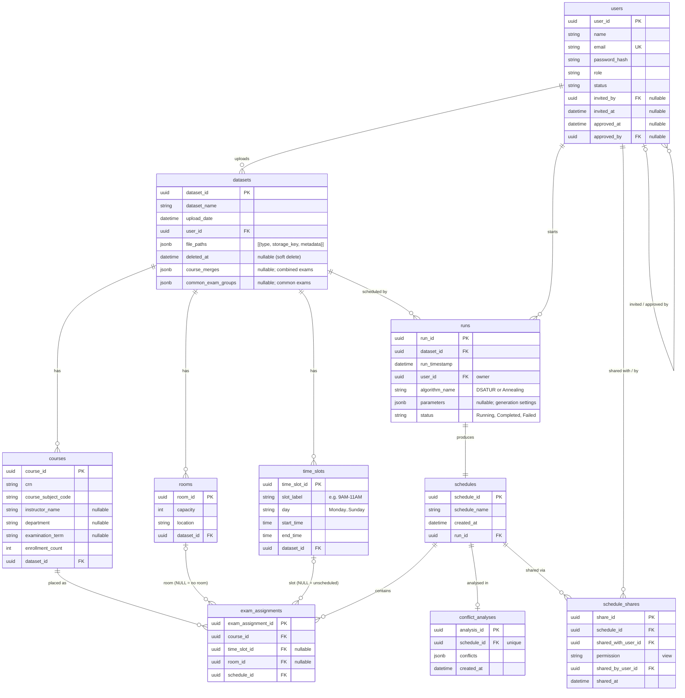

# Data Guide

CSV file formats, database management, and data operations for ExamEngine.

## CSV File Formats

ExamEngine requires three CSV files — **courses**, **enrollments**, and **rooms** — to generate exam schedules, plus three optional files: **room blockouts**, **combined exams**, and **common exams**. All files are uploaded together in one `POST /api/datasets/upload` request (multipart form fields `courses`, `enrollments`, `rooms`, `room_blockouts`, `combined_exams`, `common_exams`). Column names are auto-detected from multiple aliases (case-insensitive, whitespace-trimmed).

> **Required vs optional:** ✅ = required (the upload is rejected if the column is missing). ❌ = optional (used if present, ignored if absent). Any column not listed below is ignored. How bad *values* are handled differs by file; see [Data Validation](#data-validation).

### courses.csv

Contains course/section information. One row per CRN — if a CRN appears on multiple rows the file is de-duplicated by CRN and only the last row is kept.

| Column           | Required | Accepted Names                                                                                                 | Description                                     |
| ---------------- | -------- | ------------------------------------------------------------------------------------------------------------- | ----------------------------------------------- |
| crn              | ✅       | `Course_Reference_Number`, `CRN`, `Course Registration Number`, `crn`                                         | Unique course/section identifier                |
| course_code      | ✅       | `Course_Identification`, `CourseID`, `Course ID`, `Course Code`, `course_subject_code`, `course_code`         | e.g., "CS 4535"                                 |
| enrollment_count | ✅       | `Total_Enrollment`, `Enrollment`, `num_students`, `Student Count`, `Size`, `UG_Enrollment`, `enrollment_count` | Number of students (non-negative integer; sections with 0 are dropped before scheduling) |
| instructor_name  | ❌       | `Primary_Instructor_PIDM`, `Instructor Name`, `Instructor`, `Faculty Name`, `Professor`, `instructor_name`    | Instructor's name                               |
| department       | ❌       | `Course_Department_Code`, `Course_Department_Desc`, `department`, `dept`                                       | Department code, e.g., "CSCI"                   |
| examination_term | ❌       | `Academic_Period_NUFreeze`, `Academic_Period`, `exam_term`, `examination_term`                                | e.g., "Fall 2025"                               |

> If `instructor_name` is absent (or blank on a row), that section is excluded from all instructor constraints — the scheduler will not track faculty exams-per-day or instructor back-to-back for it.

> A section whose enrollment exceeds the largest room in rooms.csv is not rejected: exams are never seated over a room's capacity, so the scheduler leaves it unscheduled. The upload response lists such sections (zero-enrollment ones excluded) under `files.courses.oversized_sections` as `[{crn, course, enrollment, largest_room}]`, sorted by CRN, and the UI warns about them after upload and in the sidebar. Only sections in no combined or common group are listed there; an oversized CRN inside a group is reported with its group instead (`files.combined_exams.over_capacity_groups` or `files.common_exams.infeasible_groups`), because the scheduler leaves the whole group unscheduled.

**Example:**

```csv
CRN,CourseID,Enrollment,Instructor Name,department,examination_term
11310,CS 3500,150,Dr. Smith,CSCI,Fall 2025
11311,CS 4535,45,Dr. Johnson,CSCI,Fall 2025
```

### enrollments.csv

Maps students to the courses they're enrolled in. Only these two columns are read; any others are ignored.

| Column | Required | Accepted Names                                                                                         | Description                                           |
| ------ | -------- | ----------------------------------------------------------------------------------------------------- | ----------------------------------------------------- |
| NUID   | ✅       | `NUID`, `NU ID`, `Student ID`, `Student Number`, `student_id`, `Student_PIDM`, `PIDM`, `student_pidm` | Student's NUID, read as text (leading zeros are kept) |
| crn    | ✅       | `Course_Reference_Number`, `CRN`, `Course Registration Number`, `crn`                                 | Must match a CRN in courses.csv                       |

**Example:**

```csv
NUID,CRN
001234567,11310
001234567,11311
001234568,11310
```

### rooms.csv

Available exam rooms and their capacities.

| Column    | Required | Accepted Names                                                                                          | Description                        |
| --------- | -------- | ------------------------------------------------------------------------------------------------------ | ---------------------------------- |
| room_name | ✅       | `Location Name`, `Room`, `Room Name`, `Location`, `Building + Room`, `Location Formal Name`, `room_name` | Room identifier                    |
| capacity  | ✅       | `Capacity`, `Seats`, `Max Capacity`, `capacity`                                                         | Maximum seating (positive integer) |

**Example:**

```csv
Room,Capacity
Shillman 105,200
Ell Hall 312,75
Curry Student Center 440,150
```

### room_blockouts.csv (optional)

Marks specific (room, day, time-block) combinations as unavailable. This file is optional — omit it if there are no blockouts. All three columns are required; invalid rows are skipped individually rather than aborting the upload.

| Column | Required | Accepted Names                                               | Description                                         |
| ------ | -------- | ----------------------------------------------------------- | -------------------------------------------------- |
| Room   | ✅       | `Room`, `Location Name`, `Location`, `Room Name`, `room`, `room_name` | Room to block (should match a room in rooms.csv)   |
| Day    | ✅       | `Day`, `Weekday`, `day`, `day_index`, `Day Index`           | `0`–`6` (Monday = 0) or a day name, e.g., "Monday" |
| Block  | ✅       | `Block`, `Time Block`, `block`, `block_index`, `Block Index` | `0`–`4` or a time string, e.g., "9AM-11AM"         |

**Example:**

```csv
Room,Day,Block
Shillman 105,0,2
West Village H 212,Monday,9AM-11AM
```

### combined_exams.csv (optional)

Defines combined exams: groups of course sections (CRNs) merged into one exam — same time block **and same room**. Each group is a **merge group**, and the group label is its identifier. This file is optional — omit it if no sections share an exam. It uses long format, one row per (group, CRN); a group needs at least two rows. Cells are read as text, so labels such as `01` and `1` are different groups. Blank lines are ignored. Unlike room blockouts, any invalid row fails the whole upload (see the validation rules below).

| Column                  | Required | Accepted Names                                                                                        | Description                                               |
| ----------------------- | -------- | ---------------------------------------------------------------------------------------------------- | --------------------------------------------------------- |
| Exam_Group              | ✅       | `Exam_Group`, `ExamGroup`, `Exam Group`, `Common Exam`, `merge_group`, `merge_group_id`, `Group`, `group_id` | Group label (whitespace-trimmed), e.g., "MATH Common Final" |
| Course_Reference_Number | ✅       | `Course_Reference_Number`, `CRN`, `Course Registration Number`, `crn`                                | Must match a CRN in courses.csv                           |

**Example:**

```csv
ExamGroup,CRN
MATH Common Final,11315
MATH Common Final,11316
PHYS Common Final,11320
PHYS Common Final,11321
```

**Validation rules:**

| #   | Rule                                                                         | Result                                                                                           |
| --- | ---------------------------------------------------------------------------- | ------------------------------------------------------------------------------------------------ |
| V1  | A required column is missing                                                 | ❌ Upload rejected                                                                               |
| V2  | A row has a blank group or a blank CRN, or the CRN has a decimal part (e.g. `11316.9`) | ❌ Upload rejected (error lists the row numbers)                                       |
| V3  | The same CRN appears in two different groups                                 | ❌ Upload rejected                                                                               |
| V4  | A group has fewer than 2 distinct CRNs                                       | ❌ Upload rejected                                                                               |
| V5  | Exact duplicate (group, CRN) rows                                            | ✅ Accepted; duplicates are silently de-duplicated                                               |
| V6  | A CRN is not in courses.csv, or has zero enrollment there (the scheduler drops zero-enrollment sections) | ❌ Upload rejected                                                   |
| V7  | A group's combined enrollment exceeds the largest room in rooms.csv          | ⚠️ Warning only; the group is saved and reported in the upload response as `over_capacity_groups` |
| V8  | The file is empty, has no groups (header only), or is not a parseable CSV    | ❌ Upload rejected                                                                               |
| V9  | Two group labels differ only in capitalization or spacing (e.g. `MATH Final` / `math final`) | ❌ Upload rejected (likely a typo)                                               |

Problems within the file itself (V2–V5, V8, V9) are reported together. Checks against courses.csv and rooms.csv (V6, V7) run only once every file passes its own checks. A rejected upload returns HTTP 400 `{"detail": {"message": "File validation failed", "errors": {"combined_exams": "<reason>"}}}`, and nothing is stored. Over-capacity groups (V7) are saved but no room can hold them, so the scheduler reports them as unscheduled. The upload response reports the file under `files.combined_exams` as `{rows, exam_groups, merged_crns, over_capacity_groups}`.

Valid groups are stored in the `datasets.course_merges` JSONB column as `{group_label: [CRN, ...]}` (CRNs in order of first appearance), e.g., `{"MATH Common Final": ["11315", "11316"]}`. Combined groups can only be set by uploading this file; to change them, upload a new dataset. They are read back with `GET /api/datasets/{dataset_id}/merges` (the column and route keep their original "merges" names).

> Datasets uploaded before combined and common exams were split stored this file as `common_exams.csv` (file type `common_exams`, metadata with `exam_groups`). They are still reported as `combined_exams`.

### common_exams.csv (optional)

Defines common exams: groups of course sections (CRNs) that sit in the **same time block but in different rooms** (e.g. so exam content can't leak between sections). This file is optional and separate from combined_exams.csv. It uses the same long format and file-level rules as combined exams (text cells, blank lines ignored, duplicates de-duplicated, labels differing only in case/spacing rejected, at least 2 distinct CRNs per group), but a different group header, so a combined exam file uploaded in this slot is rejected rather than silently misread.

| Column                  | Required | Accepted Names                                                        | Description                                         |
| ----------------------- | -------- | --------------------------------------------------------------------- | --------------------------------------------------- |
| Common_Group            | ✅       | `Common_Group`, `CommonGroup`, `Common Group`, `common_group`          | Group label (whitespace-trimmed), e.g., "BIOL 1101 Final" |
| Course_Reference_Number | ✅       | `Course_Reference_Number`, `CRN`, `Course Registration Number`, `crn` | Must match a CRN in courses.csv                     |

**Example:**

```csv
Common_Group,CRN
BIOL 1101 Final,11111
BIOL 1101 Final,33333
BIOL 1101 Final,44444
```

**Combined groups inside a common group (closure rule):** if a CRN listed in a common group belongs to a combined group, the entire combined group belongs to that common group and still shares one room. Listing one or all members of the combined group is equivalent. Each combined group or lone CRN is a **room unit** that gets its own room. With combined group `{11111, 22222}`, the example above schedules one time block with three rooms: 11111+22222, 33333, and 44444.

**Validation rules** (in addition to the file-level rules V1–V5, V8, V9 above, with "group" meaning common group):

| #   | Rule                                                                                         | Result                                                                                                          |
| --- | -------------------------------------------------------------------------------------------- | --------------------------------------------------------------------------------------------------------------- |
| C1  | The same CRN appears in two different common groups                                           | ❌ Upload rejected                                                                                              |
| C2  | A CRN is not in courses.csv, or has zero enrollment there                                     | ❌ Upload rejected                                                                                              |
| C3  | Members of one combined group are listed in different common groups                           | ❌ Upload rejected                                                                                              |
| C4  | A common group has fewer than 2 room units after the closure rule (e.g. it only lists members of one combined group) | ❌ Upload rejected                                                                       |
| C5  | The group's room units can't all be seated at once (each in its own room; largest unit first into the smallest room that fits, over all rooms, ignoring blockouts) | ⚠️ Saved; reported as `infeasible_groups: [{group, reason}]`. The scheduler leaves the **whole** group unscheduled |
| C6  | A student is enrolled in 2+ room units of the same common group                                | ⚠️ Saved; reported as `student_overlap_groups: [{group, students}]` (those students have simultaneous exams)    |

Cross-file checks (C2–C4) run once every file passes its own checks; errors in combined_exams.csv and common_exams.csv are reported together, e.g. HTTP 400 `{"detail": {"message": "File validation failed", "errors": {"common_exams": "<reason>"}}}`. The upload response reports the file under `files.common_exams` as `{rows, common_groups, common_crns, infeasible_groups, student_overlap_groups}`.

Valid groups are stored, as listed (closure is applied at scheduling time), in the nullable `datasets.common_exam_groups` JSONB column as `{group_label: [CRN, ...]}`. The scheduler places common groups before all other exams; a group is never split across blocks or partially placed. Common groups can only be set by uploading this file; to change them, upload a new dataset. They are read back with `GET /api/datasets/{dataset_id}/common-exams`.

## Data Validation

The system automatically:

- Detects column names from aliases (case-insensitive)
- Cleans whitespace and formats
- Converts numeric strings (e.g., "11310.0" → "11310")
- Reports validation errors with row numbers

When bad values are caught:

| File | At upload | When a schedule is generated |
| ---- | --------- | ---------------------------- |
| courses, enrollments, rooms | Only the required **columns** are checked (plus statistics). Course rows are also parsed when combined or common exams are attached; then a bad course row rejects the upload. | **courses:** a row with a missing CRN or course code, or an invalid enrollment, fails generation (up to 10 rows listed). **enrollments:** rows missing the student or CRN are skipped; rows whose CRN isn't in courses.csv are ignored. **rooms:** rows missing the name or capacity, or with capacity ≤ 0, are skipped (generation fails only if no room is valid). Sections with 0 enrollment are dropped. |
| combined_exams, common_exams | Any invalid row or group rejects the upload (rules above) | – |
| room_blockouts | Invalid rows are skipped individually | Same |

### Common Validation Errors

| Error                                      | When                                | Cause                         | Fix                       |
| ------------------------------------------ | ----------------------------------- | ----------------------------- | ------------------------- |
| "Missing columns: …"                       | Upload                              | A required column isn't there | Use accepted column names |
| "CSV columns don't match any known schema" | Upload                              | Column names not recognized   | Use accepted column names |
| "Row N: Missing CRN"                       | Generation (or upload with groups)  | Empty or null CRN value       | Ensure all rows have CRN  |
| "Enrollment count cannot be negative"      | Generation (or upload with groups)  | Negative number in enrollment | Fix data or remove row    |

## Database Operations

### Local Development

```bash
# Reset database (drops all tables, recreates schema)
cd backend
python src/schemas/reset_database.py

# Or via Docker
docker-compose --profile dev exec backend-dev python src/schemas/reset_database.py
```

### Database Schema

Defined in `backend/src/schemas/db.py` (SQLAlchemy). Courses, rooms and time slots belong to a
dataset and are shared by every schedule generated from it.


```mermaid
erDiagram
    users ||--o{ datasets : uploads
    users ||--o{ runs : starts
    users ||--o{ schedule_shares : "shared with / by"
    users |o--o{ users : "invited / approved by"
    datasets ||--o{ courses : has
    datasets ||--o{ rooms : has
    datasets ||--o{ time_slots : has
    datasets ||--o{ runs : "scheduled by"
    runs ||--|| schedules : produces
    schedules ||--o{ exam_assignments : contains
    schedules ||--o| conflict_analyses : "analysed in"
    schedules ||--o{ schedule_shares : "shared via"
    courses ||--o{ exam_assignments : "placed as"
    time_slots |o--o{ exam_assignments : "slot (NULL = unscheduled)"
    rooms |o--o{ exam_assignments : "room (NULL = no room)"

    users {
        uuid user_id PK
        string name
        string email UK
        string password_hash
        string role
        string status
        uuid invited_by FK "nullable"
        datetime invited_at "nullable"
        datetime approved_at "nullable"
        uuid approved_by FK "nullable"
    }
    datasets {
        uuid dataset_id PK
        string dataset_name
        datetime upload_date
        uuid user_id FK
        jsonb file_paths "[{type, storage_key, metadata}]"
        datetime deleted_at "nullable (soft delete)"
        jsonb course_merges "nullable; combined exams"
        jsonb common_exam_groups "nullable; common exams"
    }
    courses {
        uuid course_id PK
        string crn
        string course_subject_code
        string instructor_name "nullable"
        string department "nullable"
        string examination_term "nullable"
        int enrollment_count
        uuid dataset_id FK
    }
    rooms {
        uuid room_id PK
        int capacity
        string location
        uuid dataset_id FK
    }
    time_slots {
        uuid time_slot_id PK
        string slot_label "e.g. 9AM-11AM"
        string day "Monday..Sunday"
        time start_time
        time end_time
        uuid dataset_id FK
    }
    runs {
        uuid run_id PK
        uuid dataset_id FK
        datetime run_timestamp
        uuid user_id FK "owner"
        string algorithm_name "DSATUR or Annealing"
        jsonb parameters "nullable; generation settings"
        string status "Running, Completed, Failed"
    }
    schedules {
        uuid schedule_id PK
        string schedule_name
        datetime created_at
        uuid run_id FK
    }
    exam_assignments {
        uuid exam_assignment_id PK
        uuid course_id FK
        uuid time_slot_id FK "nullable"
        uuid room_id FK "nullable"
        uuid schedule_id FK
    }
    conflict_analyses {
        uuid analysis_id PK
        uuid schedule_id FK "unique"
        jsonb conflicts
        datetime created_at
    }
    schedule_shares {
        uuid share_id PK
        uuid schedule_id FK
        uuid shared_with_user_id FK
        string permission "view"
        uuid shared_by_user_id FK
        datetime shared_at
    }
```

JSON written by the scheduler:

- `runs.parameters`: the generation settings, `{student_max_per_day, instructor_max_per_day,
  avoid_back_to_back, max_days, blocks_per_day, prioritize_large_courses, algorithm,
  time_budget_seconds}`. Runs from before a setting existed lack its key.
- `conflict_analyses.conflicts`: `{hard_conflicts, soft_conflicts, statistics,
  unscheduled_groups}`. `hard_conflicts` holds `student_double_book`, `instructor_double_book`,
  `student_gt_max_per_day` and `instructor_gt_max_per_day` lists; `soft_conflicts` holds
  `back_to_back_students`, `back_to_back_instructors` and `large_courses_not_early`;
  `statistics` holds totals and a `*_count` per type; `unscheduled_groups` is
  `[{kind, group, reason, crns}]`. Written once when the schedule is generated.

`datasets.common_exam_groups` (nullable JSONB) was added after the initial schema. `init_db` adds it on startup to existing Postgres databases with `ALTER TABLE datasets ADD COLUMN IF NOT EXISTS common_exam_groups JSONB DEFAULT NULL` (idempotent; no data migration needed).

### Schedule summary

Every number the app shows about a schedule (Statistics tab, the Conflicts tab's summary cards,
the settings in the schedule header, the compare page) comes from one server function,
`backend/src/services/schedule/summary.py`. It reads saved rows only: the schedule's exam
assignments, the conflict breakdown, the stored unscheduled groups, the run and the dataset's
stored metadata; never the uploaded files. It is the `summary` field of
`GET /api/schedule/{id}` (and of the generate response) and of each item of
`GET /api/schedule/compare`.

| Field | Meaning |
| --- | --- |
| `settings` | The run's settings. `algorithm` falls back to `runs.algorithm_name` for runs from before it was recorded; settings a run didn't record are `null`, except `blocks_per_day`, which is 5 (the only option then) |
| `settings_assumed` | Settings filled in that way (`["blocks_per_day"]` or `[]`) |
| `settings_unused` | Recorded settings the run's algorithm ignores: Classic (`dsatur`) `["time_budget_seconds", "avoid_back_to_back"]`, Optimized (`annealing`) `["prioritize_large_courses"]` |
| `unique_students` | From the enrollments upload metadata; `null` when unknown |
| `exams` | Counts: `total`; `placed` (a day, a time and a room); `unscheduled` (no time slot); `unroomed` (a time slot, no room); `over_capacity` (placed, size > a known capacity) |
| `unscheduled`, `unroomed` | The exams (`crn`, `course`, `size`) and their summed enrollment. `unscheduled` also has the stored `groups` and `other_crns` (unscheduled CRNs no group explains) |
| `over_capacity` | `{crn, course, size, room, capacity}`, largest overflow first |
| `conflicts` | Per type: `people` (distinct students or instructors; distinct exams for `large_courses_late`) and `instances`. Types: `student_double_book`, `instructor_double_book`, `student_over_daily_limit`, `instructor_over_daily_limit`, `student_back_to_back`, `instructor_back_to_back`, `large_courses_late` |
| `rooms` | `used` (distinct rooms with a placed exam); `average_fill` (mean of size / capacity per placed exam with a known capacity, each capped at 100%, one decimal); `fill_buckets` (`under_50`, `from_50_to_75`, `from_75_to_90`, `from_90_to_100`; lower bound inclusive) |
| `calendar` | `slots_used` and `days_used` (distinct (day, block) pairs and days holding an exam, unroomed included); `days` (placed exams and seats per day, Monday first); `blocks` (placed exams per block, earliest first); `matrix` (placed exams per `[day][block]` in those orders) |
| `groups` | `combined` and `common`: group count, and the exams (any state) in them with their summed enrollment. A combined group with any CRN in a common group counts as common as a whole |
| `blockouts` | Rooms blocked and blocked (room, slot) entries, from the room blockouts upload metadata |

`instances` counts occurrences the way the Conflicts tab merges records: one per person, day and
time for double-books (a 3-way double-book, stored as 3 pairs, is 1), one per person and day for
the daily limits, one per record for back-to-back and large courses late. A record without a
person counts as its own person.

`GET /api/schedule/compare?ids=<id>&ids=<id>…` takes 1–4 distinct schedule IDs (duplicates are
dropped; more than 4 is 422) and returns `{schedules: [...]}` in the requested order. A schedule
the caller can't view, or that doesn't exist, is `{schedule_id, status: "unavailable"}` with
nothing else. Others are `status: "ok"` with name, `created_at`, `run_status`, `dataset
{dataset_id, dataset_name, uploaded_at, deleted}`, the owner/share fields and `summary`.

`POST /api/schedule/{id}/late-add/search` with `{crn, course_code, instructor_id}` finds a block
for one exam that missed generation (see "Late add" in `ALGORITHM.md`). It is read-only. Only
the schedule's owner may use it (anyone else gets 404); a deleted dataset is 409, since its files
are gone; a blank field (an instructor ID of `nan`, any case, counts as blank), a CRN already in
the schedule (placed or unscheduled), a CRN that courses.csv lists with a nonzero enrollment (a
scheduled course, not a late add) or a CRN with no rows in enrollments.csv is 400. A courses.csv
CRN with zero enrollment (skipped by generation) is allowed with a note. It reads the schedule,
its run settings, the dataset's rooms and its combined and common groups from the database, and
the courses, enrollments and room blockouts from the uploaded files, parsed unfiltered
(`services/dataset/uploaded_files.py`, shared with the Validator). The response is
`{schedule_id, crn, course_code, instructor_id, size, outcome, settings, candidates,
no_room_blocks, instructor_exams, sibling_sections, notes}`; `outcome` is `clear`,
`least_conflicts` or `no_room`, and `candidates` are ranked, each with its block, best-fit room,
other fitting rooms, conflict counts and the students and instructor affected.

### Late-add lineage

A late add saves a new schedule; its run (`algorithm_name` `"Late add"`) stores the base run's
resolved settings in `runs.parameters` plus `based_on_schedule_id`, `original_schedule_id` (the
first generated schedule of the chain) and `late_additions` (every exam added along the chain,
oldest first). Because `parameters.algorithm` is the base's, the summary shows the base's engine
and `settings_unused`.

`GET /api/schedule/{id}` always has `lineage`, read from the database only:

| Field | Meaning |
| --- | --- |
| `based_on`, `original` | `{id, name, available}`; `null` for generated schedules. A deleted schedule, or one the caller can't view, is `available: false` with `name: null` |
| `late_additions` | The stored entries (`crn`, `course_code`, `instructor_id`, `size`, `day`, `day_name`, `block`, `block_time`, `room`, `outcome`, `conflicts`, `added_by`, `added_by_name`, `added_at`, `schedule_id` of the version that added it); `[]` for generated schedules |
| `newer_versions` | `{id, name, created_at}` of schedules based directly on this one that the caller can view, newest first |

Each `GET /api/schedule` item has `late_add_count` (0 for generated schedules) and
`based_on_name` (`null` for generated schedules and when the base is deleted or not viewable).

## S3 Storage Structure

Datasets are stored in S3 with the following structure:

```
s3://$AWS_S3_BUCKET/          # default exam-engine-csvs (LocalStack locally, MinIO on Coolify)
└── {dataset_uuid}/
    ├── courses.csv
    ├── enrollments.csv
    ├── rooms.csv
    ├── room_blockouts.csv   # only if uploaded
    ├── combined_exams.csv   # only if uploaded
    └── common_exams.csv     # only if uploaded
```

Files are private (no public access); the backend reads them with the configured S3 credentials.

## Troubleshooting

### "Dataset already exists"

A dataset with the same name exists. Use a unique name or delete the existing one.

### "CRNs not found in courses"

A combined_exams or common_exams file lists a CRN that isn't in courses.csv. Ensure CRNs match
exactly. (Enrollment rows whose CRN isn't in courses.csv are ignored, not rejected.)

### Large file uploads timing out

For very large files (>50MB), consider:

- Splitting enrollments by term
- Removing historical/inactive courses
- Increasing upload timeout in nginx config in (dev environment)
