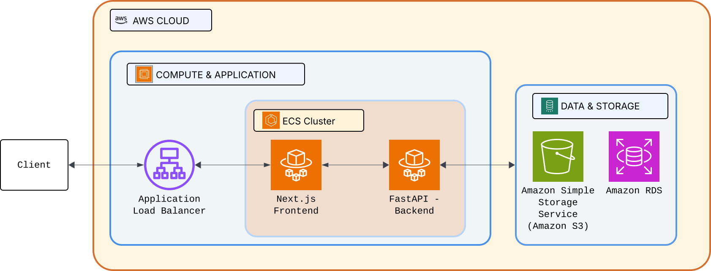

# Infrastructure Guide

AWS deployment and Terraform configuration for ExamEngine.

## Architecture Overview



## AWS Resources

| Resource      | Service        | Purpose                        |
| ------------- | -------------- | ------------------------------ |
| Compute       | ECS Fargate    | Containerized frontend/backend |
| Load Balancer | ALB            | HTTPS termination, routing     |
| Database      | RDS PostgreSQL | Persistent data storage        |
| Storage       | S3             | Dataset file storage           |
| Certificates  | ACM            | SSL/TLS certificates           |

## Terraform Structure

```
infrastructure/terraform/
├── main.tf              # Provider config, data sources
├── variables.tf         # Input variables
├── terraform.tfvars     # Variable values (gitignored)
├── output.tf            # Output values
├── ecs.tf               # ECS cluster, services, tasks
├── alb.tf               # Application Load Balancer
├── rds.tf               # RDS PostgreSQL instance
├── s3.tf                # S3 bucket for datasets
├── iam.tf               # IAM roles and policies
├── securify_group.tf    # Security groups
└── acm.tf               # Certificate references
```

## Deployment

### Prerequisites

- AWS CLI configured with appropriate credentials
- Terraform 1.5+
- Docker for building images

### Initial Setup

```bash
cd infrastructure/terraform

# Copy and configure variables
cp terraform.tfvars.example terraform.tfvars
# Edit terraform.tfvars with your values

# Initialize Terraform
terraform init

# Plan changes
terraform plan

# Apply infrastructure
terraform apply
```

### Variable Configuration

Create `terraform.tfvars`:

```hcl
environment    = "production"
aws_region     = "us-east-1"
bucket_name    = "examengine-datasets-prod"

# Database
db_username    = "examengine"
db_password    = "your-secure-password"

# Container images (after pushing to ECR)
frontend_image = "123456789.dkr.ecr.us-east-1.amazonaws.com/examengine-frontend:latest"
backend_image  = "123456789.dkr.ecr.us-east-1.amazonaws.com/examengine-backend:latest"
```

### Building and Pushing Images (Without CI/CD)

```bash
# Login to ECR
aws ecr get-login-password --region us-east-1 | docker login --username AWS --password-stdin 123456789.dkr.ecr.us-east-1.amazonaws.com

# Build and push frontend
docker build -t examengine-frontend -f frontend/Dockerfile .
docker tag examengine-frontend:latest 123456789.dkr.ecr.us-east-1.amazonaws.com/examengine-frontend:latest
docker push 123456789.dkr.ecr.us-east-1.amazonaws.com/examengine-frontend:latest

# Build and push backend
docker build -t examengine-backend -f backend/Dockerfile .
docker tag examengine-backend:latest 123456789.dkr.ecr.us-east-1.amazonaws.com/examengine-backend:latest
docker push 123456789.dkr.ecr.us-east-1.amazonaws.com/examengine-backend:latest
```

### Deploying Updates (Without CI/CD)

```bash
# Force new deployment (pulls latest image)
aws ecs update-service --cluster examengine-production \
  --service examengine-frontend-service-production \
  --force-new-deployment

aws ecs update-service --cluster examengine-production \
  --service examengine-backend-service-production \
  --force-new-deployment
```

## Security Groups

| Group     | Inbound               | Outbound              |
| --------- | --------------------- | --------------------- |
| ALB       | 80, 443 from anywhere | All to ECS            |
| ECS Tasks | 3000, 8000 from ALB   | All (internet access) |
| RDS       | 5432 from ECS         | None                  |

## Monitoring

### ECS Service Health

```bash
# Check service status
aws ecs describe-services --cluster examengine-production \
  --services examengine-backend-service-production

# View running tasks
aws ecs list-tasks --cluster examengine-production
```

### Logs

```bash
# View backend logs
aws logs tail /ecs/examengine-backend --follow

# View frontend logs
aws logs tail /ecs/examengine-frontend --follow
```

## Costs Estimate

| Resource                 | Estimated Monthly Cost |
| ------------------------ | ---------------------- |
| ECS Fargate (2 services) | ~$30-50                |
| RDS db.t3.micro          | ~$15-20                |
| ALB                      | ~$20                   |
| S3                       | ~$1-5                  |

**Total:** ~$70-100/month

## Destroying Infrastructure

```bash
# Destroy all resources (careful!)
terraform destroy

# Or remove specific resources
terraform destroy -target=aws_ecs_service.frontend
```
