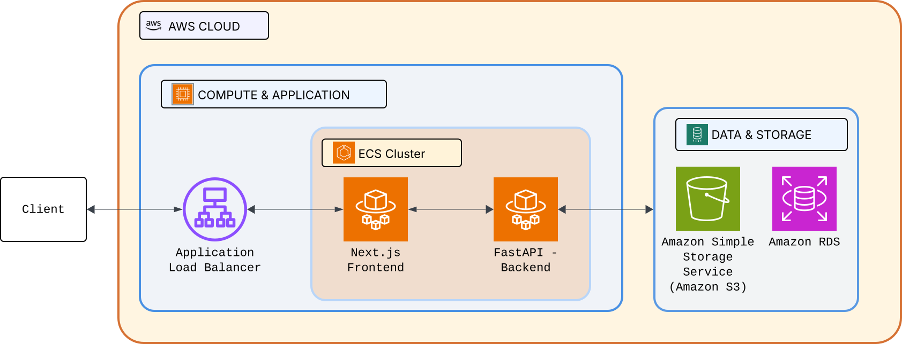

# Infrastructure Guide

AWS deployment and Terraform configuration for ExamEngine.

## Architecture Overview



## AWS Resources

| Resource        | Service              | Purpose                                      |
| --------------- | -------------------- | -------------------------------------------- |
| Compute         | ECS Fargate          | Containerized frontend (Next.js) and backend (FastAPI) |
| Load Balancer   | ALB                  | HTTPS termination, path-based routing        |
| Database        | RDS PostgreSQL       | Persistent data storage                      |
| Storage         | S3                   | Dataset file uploads                         |
| DNS             | Route53              | Hosted zone + ALB alias record               |
| Certificates    | ACM                  | TLS certificate (auto-validated via Route53) |
| Secrets         | Secrets Manager      | DATABASE_URL and SECRET_KEY at runtime       |
| Config          | SSM Parameter Store  | CI/CD config discovery (ECR URIs, service names) |
| Auth (CI/CD)    | IAM OIDC             | GitHub Actions assumes role — no long-lived keys |
| Auth (ECS)      | IAM Task Role        | ECS containers access S3 — no credentials needed |

## Terraform Structure

```
infrastructure/terraform/
├── environments/
│   ├── prod/
│   │   ├── main.tf          # Provider, backend config, module call
│   │   ├── variables.tf     # Prod-specific variable declarations
│   │   └── outputs.tf       # Outputs (role ARN, nameservers, etc.)
│   ├── staging/
│   │   ├── main.tf
│   │   ├── variables.tf
│   │   └── outputs.tf
│   └── terraform.tfvars.example  # Template for both environments
└── modules/examengine/
    ├── acm.tf               # ACM certificate (DNS-validated)
    ├── alb.tf               # Application Load Balancer + target groups
    ├── ecs.tf               # Cluster, task definitions, services
    ├── github-oidc.tf       # OIDC provider + GitHub Actions IAM role
    ├── iam.tf               # ECS task execution role + task role (S3 access)
    ├── main.tf              # Data sources (caller identity)
    ├── output.tf            # Module outputs
    ├── rds.tf               # RDS PostgreSQL instance
    ├── route53.tf           # Hosted zone + ALB alias record
    ├── s3.tf                # S3 bucket for datasets
    ├── secrets.tf           # Secrets Manager entries
    ├── securify_group.tf    # Security groups (ALB, ECS, RDS)
    ├── ssm.tf               # SSM parameters for CI/CD discovery
    ├── variables.tf         # Module input variables
    └── vpc.tf               # VPC, subnets, NAT Gateway, routing
```

## Multi-Account Setup

Prod and staging run in **separate AWS accounts**. Each account has its own:
- Terraform state bucket (`examengine-terraform-state` / `examengine-terraform-state-staging`)
- ECR repositories (`fastapi-backend`, `next-web`)
- IAM roles, RDS instance, ECS cluster, S3 bucket
- OIDC role trusted only to the relevant deploy branch (`main` or `staging`)

This eliminates IAM naming conflicts between environments.

## Initial Deployment

### Prerequisites

- AWS CLI configured for the target account
- Terraform 1.0+
- ECR repositories created: `fastapi-backend` and `next-web`
  ```bash
  aws ecr create-repository --repository-name fastapi-backend
  aws ecr create-repository --repository-name next-web
  ```

### 1. Configure Variables

```bash
cd infrastructure/terraform/environments/prod   # or staging

cp ../terraform.tfvars.example terraform.tfvars
# Edit terraform.tfvars — see Variable Reference below
```

### 2. Apply Infrastructure

```bash
terraform init
terraform plan
terraform apply
```

### 3. Configure DNS

After `terraform apply`, the outputs include `route53_nameservers`. Add these as NS records at your domain registrar (e.g. Porkbun) for the subdomain:

```
examengine.example.com  NS  ns-xxx.awsdns-xx.com
```

### 4. Add GitHub Secrets

The `github_actions_role_arn` output is the IAM role GitHub Actions assumes via OIDC. Add it to your GitHub repository:

| Secret | Value |
|--------|-------|
| `AWS_GITHUB_ACTIONS_ROLE_ARN_PROD` | `github_actions_role_arn` output from prod |
| `AWS_GITHUB_ACTIONS_ROLE_ARN_STAGING` | `github_actions_role_arn` output from staging |

### 5. Push to Deploy

Once infrastructure is up and GitHub secrets are set, push to the deploy branch to trigger CI/CD:

```bash
git push origin main     # deploys to prod
git push origin staging  # deploys to staging
```

## Variable Reference

Create `terraform.tfvars` in the environment directory:

```hcl
aws_region  = "us-east-1"
environment = "prod"            # or "staging"

# Domain
domain_name  = "examengine.example.com"
frontend_url = "https://examengine.example.com"

# S3
bucket_name = "examengine-datasets-prod"

# RDS
db_instance_class = "db.t3.small"   # use db.t3.micro for staging
db_username       = "postgres"
db_password       = "strong-password-here"
database_url      = "postgresql+psycopg2://postgres:strong-password-here@<rds-endpoint>:5432/exam_engine_db"

# App secrets
secret_key    = "$(openssl rand -hex 32)"

# CI/CD branch (default already set in variables.tf)
# deploy_branch = "main"
```

> **Note:** `database_url` references the RDS endpoint, which is only known after the first `terraform apply`. On the initial run, set a placeholder and update after apply.

## CI/CD Pipeline

Deployments are fully automated — no manual image builds needed.

| Branch push | Workflow | AWS account |
|-------------|----------|-------------|
| `main` | `deploy-prod.yml` | Prod |
| `staging` | `deploy-staging.yml` | Staging |

Each deploy workflow:
1. Assumes the OIDC role (no stored credentials)
2. Reads cluster name, service names, ECR URIs, and domain from SSM
3. Builds and pushes backend and frontend images to ECR
4. Force-deploys both ECS services

CI checks run on every push and PR to `main`/`staging`:
- `backend-lint.yml` — ruff check + format
- `backend-tests.yml` — pytest (no real DB or AWS required)
- `frontend-lint.yml` — Biome
- `frontend-build.yml` — Next.js build
- `frontend-unit-tests.yml` — Vitest

## Credentials & IAM

No long-lived AWS credentials are used anywhere.

| Context | Auth mechanism |
|---------|---------------|
| GitHub Actions | OIDC → assumes `examengine-github-actions-{env}` role |
| ECS containers | IAM task role → automatic S3 access via metadata service |
| Local dev | LocalStack via `AWS_ENDPOINT_URL` in `.env` |

The GitHub Actions role is scoped to a single branch per environment via the OIDC trust policy condition:
```
repo:KhourySpecialProjects/ExamEngine:ref:refs/heads/{deploy_branch}
```

## Secrets Management

Sensitive values are stored in Secrets Manager and injected at container start:

| Secret path | Consumed by |
|-------------|-------------|
| `examengine-{env}-database-url` | Backend ECS task |
| `examengine-{env}-secret-key` | Backend ECS task |

Non-sensitive config is passed as environment variables in the ECS task definition (`AWS_REGION`, `AWS_S3_BUCKET`, `ENVIRONMENT`, `FRONTEND_URL`).

## Security Groups

| Group     | Inbound                   | Outbound     |
| --------- | ------------------------- | ------------ |
| ALB       | 80, 443 from `0.0.0.0/0` | All to ECS   |
| ECS Tasks | 3000 (frontend), 8000 (backend) from ALB | All |
| RDS       | 5432 from ECS tasks       | None         |

ECS tasks run in private subnets (no public IPs). Outbound internet access goes through a NAT Gateway.

## Monitoring

### ECS Health

```bash
aws ecs describe-services \
  --cluster ee-cluster \
  --services examengine-backend-service-prod examengine-frontend-service-prod
```

### CloudWatch Logs

```bash
# Backend
aws logs tail /ecs/examengine-backend-prod --follow

# Frontend
aws logs tail /ecs/examengine-frontend-prod --follow
```

Logs are retained for 7 days.

## Manual Deployment (Without CI/CD)

```bash
ACCOUNT_ID=$(aws sts get-caller-identity --query Account --output text)
REGION=us-east-1
ENV=prod

# Login to ECR
aws ecr get-login-password --region $REGION | \
  docker login --username AWS --password-stdin $ACCOUNT_ID.dkr.ecr.$REGION.amazonaws.com

# Build and push (from repo root)
docker build -f backend/Dockerfile -t $ACCOUNT_ID.dkr.ecr.$REGION.amazonaws.com/fastapi-backend:latest .
docker push $ACCOUNT_ID.dkr.ecr.$REGION.amazonaws.com/fastapi-backend:latest

DOMAIN=$(aws ssm get-parameter --name "/examengine/$ENV/domain-name" --query 'Parameter.Value' --output text)
docker build -f frontend/Dockerfile \
  --build-arg NEXT_PUBLIC_API_URL=https://$DOMAIN \
  -t $ACCOUNT_ID.dkr.ecr.$REGION.amazonaws.com/next-web:latest .
docker push $ACCOUNT_ID.dkr.ecr.$REGION.amazonaws.com/next-web:latest

# Force deploy
aws ecs update-service --cluster ee-cluster \
  --service examengine-backend-service-$ENV --force-new-deployment
aws ecs update-service --cluster ee-cluster \
  --service examengine-frontend-service-$ENV --force-new-deployment
```

## Cost Estimate

| Resource                     | Estimated Monthly Cost |
| ---------------------------- | ---------------------- |
| ECS Fargate (2 services)     | ~$30–50                |
| RDS db.t3.micro / db.t3.small | ~$15–25               |
| ALB                          | ~$20                   |
| NAT Gateway                  | ~$35                   |
| S3                           | ~$1–5                  |
| Route53                      | ~$1                    |
| Secrets Manager              | ~$1                    |

**Total per environment:** ~$100–140/month

## Destroying Infrastructure

```bash
cd infrastructure/terraform/environments/prod
terraform destroy
```
